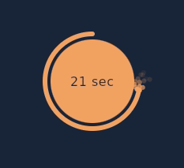

# CircleParticlesProgress
An Circlular Particles Progress For Compose Multiplatform Project



### Usage

`Add CircleParticlesProgress.kt file to your projecct & :`

```kotlin
CircleParticlesProgress(
    modifier = Modifier.size(120.dp), //composition modifier
    progress = progress, // progress float, range 0,1
    thickness = 6.dp, // style stroke width
    particlesCount = 40, // count of particles to create
    isBig = false, // scale velocity
    reverse = true, // to fill & empty
    progressColor = Color(0xFFf4a261) // color of progress & particles
)
```